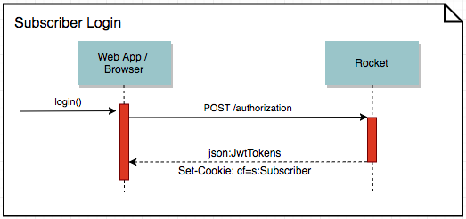
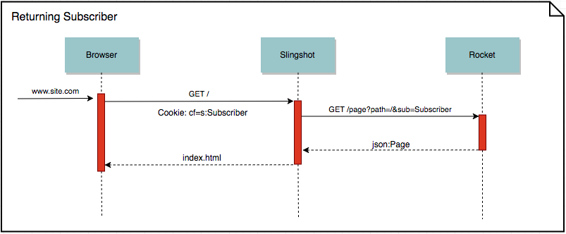

# Progressive Web Applications

## Overview

Underpinning the architecture of the Axis Web App, and the services behind it, is the concept of progressive enhancement. This aims to cater for the wide variety of browser and client device capabilities in the market today. From the lower end mobile devices on poor 3G networks to high end desktop devices on fast WiFi with modern browsers.

In order to deliver the best possible experience across this spectrum of clients we progressively enhance our Web App based on the capabilities of the client browser.

While this methodology isn't new, the range of possible enhancements has grown as browsers have become more capable.

Unlike a traditional website, we're building a single page application (SPA). This moves some complexity from the server to the client and opens the opportunity to cater for a wider set of progressive enhancements.

[Progressive web applications](https://developers.google.com/web/progressive-web-apps/) (PWA) describe this category of application. Below are some of the specific features we've implemented in the pursuit of this pattern.

## Features

### Code Splitting

In single page apps there tends to be a significant amount of client JavaScript that's needed to run the application. Traditionally this was bundled into a single file and the end user would download it when they arrived at the site.

This raises a number of performance issues.

- The user is forced to wait and download code that may not be needed for the page they've arrived on.
- The parse time of a large JavaScript bundle can be very slow, especially on low to medium powered mobile devices.
- Cachability of the JavaScript is fragile as a single code change can mean the entire file being downloaded again.

To counter these issues the concept of code splitting is introduced. The Web App uses [Webpack to code split](https://webpack.js.org/guides/code-splitting/) on each of its routes.

Routes in the Web App are slightly different to the norm as they map to _page template_ presentations, not individual paths. So for example multiple paths can lead to the same page template route, populating the page template with content specific to the page path.

We split each of these page template routes into their own JavaScript chunks and group related ones together e.g. all account pages templates in the `account` chunk. Each chunk is then output by Webpack as a javascript file, its filename includes the hash of its contents for cachability e.g `item.f3cd2ba.js`. If the contents of the chunk changes, so will its name. This allows us to set long cache lifespans on these files so CDN hits are maximized.

One point worth mentioning is that too granular chunk sizes can lead to excess request round trips. Because of this we configure Webpack to group smaller chunks together, reducing potential round trips for routes browsed in the future. This means that while we do name chunks, some may not be output if small enough to be grouped with another.

Ultimately, this allows the Web App to only load the chunks necessary for the page the user lands on.

The end result of all this is that a user arriving at the site only loads what they need. This includes the main `library` and `app` JavaScript bundles along with the chunk containing the page template the user is accessing. As the user browses other pages we load in new page template chunks on demand.

### Server Rendering

The traditional approach to single page web applications is to serve a minimal index page which, once loaded, then loads javascript and css needed to run the app. Only after these are loaded and parsed can we begin to render anything. This means the [critical render path](https://developers.google.com/web/fundamentals/performance/critical-rendering-path/) is prolonging the time needed to display something meaningful to the user, and [time](https://blog.hubspot.com/marketing/page-load-time-conversion-rates) [is](https://blog.kissmetrics.com/loading-time/) [money](https://www.fastcompany.com/1825005/how-one-second-could-cost-amazon-16-billion-sales).

In order to improve the startup time of the Web App we leverage server side rendering through the ability to run client JavaScript on the server using [Node.js](https://nodejs.org).

**We call the server component `Slingshot`**.

There are various names for this type of server rendering (i.e. Isomorphic or Universal Application) but the fundamentals are the same and that is to return enough information in the initial html page response to render something useful for the user. In our case this includes rendered html and inlined css.

After the server render is presented, the browser must then run the original SPA code which takes over the rendering responsibilities.

There can be a delay between when the server render is presented, and when the SPA takes over. This has been termed "uncanny valley". This is due to the download and parse latency of the javascript bundle(s). To keep this to a minimum we attempt to reduce our bundle sizes and load them early (see [code splitting](#code-splitting), [resource hints](#resource-hints) and [preact](#preact)).

When designing the Rocket service layer which drives our apps, and specifically the `GET /page?path=<path>` endpoint used to load a page's skeleton, we built it with the capability to populate the first `N` rows with content. This means from an app perspective we can aim to present the on-screen content (above the fold) in a single request/response.

This pattern fits nicely into server rendering where Slingshot calls Rocket's `/page` endpoint and then server renders the above the fold content into the index page.

It's worth pointing out that as Slingshot has no way of knowing client dimensions it makes a best guess of how many rows to initially populate.

The key point is we avoid rendering the entire page as this would increase server render times, response times and client render times.

**Improved initial start up time is the primary aim of server rendering.**

#### Content Filter Cookies

Another aspect to server rendering is knowing what content to render based on a user. For example content returned from Rocket (pages, navigation, lists and items) can be filtered by various rules including `subscription code`, `segmentation tags` and `max classification rating`. These filters are passed as query parameters to Rocket requests from client applications.

When a user arrives at the website and their browser makes a request to Slingshot for the initial page, there's no means to pass query parameters unless they were present in the link already. The only sensible approach is to set cookies which can contain content filters and which are automatically sent with all Slingshot requests.

To support this Rocket can issue cookies when a user requests an authorization token. These cookies only contain the content filters associated with
the account and profile in operation.

Now when a user returns to the site these cookies are sent to Slingshot with the initial page request. It can then decode and forward them on to Rocket requests before server rendering the response.

This mechanism is not foolproof. Because Rocket does not issue the authorization tokens in cookies, only the content filters, they can become out of sync. For example the account may be locked or a subscription changed. This means there's a potential, although not too common, to server render the wrong content. For this reason the Web App has a start-up check to compare filters used on the server with those found on the client. If there's a mismatch the server render is overwritten with the correct render client side.

Because cookies are issued there is a requirement for both Slingshot and Rocket to be on the same top level domain. There is also a default expectation from the Web App that Rocket and Slingshot will be served from the same subdomain too. For example

    Slingshot: https://www.domain.com
    Rocket: https://www.domain.com/api/*

With this setup we are able to lock down the cookies issued from Rocket to a single origin. This avoids sending cookies in requests where they're not needed and means tighter security from the browser.

That said it is also possible although not recommended, to run Rocket on a different subdomain.

    Slingshot: https://www.domain.com
    Rocket: https://api.domain.com

With this setup cookies issued by Rocket must be sent to all subdomains and the Web App must open its Fetch credentials policy from `same-origin` to `include`. See [Fetch#credentials](https://developer.mozilla.org/en-US/docs/Web/API/Request/credentials) and the source code (see src/shared/app/startup.ts#192).

#### Slingshot Caching

We rely on a wide variety of variables to render a response. These can come from cookies and request headers and in the future may also be determened by authorization tokens refreshed by Slingshot.

For this reason we issue a `Cache-Control: no-cache` policy on all responses. We do have a good deal of caching at the Slingshot level however using Redis.

The cache lifespan of server renders heading out of Slingshot are based on two environment variables.

- `CACHE_MIN_TTL` Defines how long a cache entry will live in and be returned from cache.
- `CACHE_MAX_AGE` Defines how long a cache entry will be seen as fresh. When a request comes in and a cache entry for it is beyond this lifespan then it will be refreshed in the background while the "stale" version from cache is returned. This ensures fast response times at the cost of slightly stale data for the occasional user.

For further details of these options see the .env-sample (/.env-sample) file.

##### Caching Warming

The best case scenario for performance is that a request is always served from cache. As we know certain pages are likely to be hit often, or be the common entry points to the site, we can configure them to always be kept in cache. This is supported in Slingshot via the `CACHE_WARM` environment variable.

This defines the list of pages along with their content filter options that should be kept rendered in Redis cache. Slingshot will ensure based on the `CACHE_MIN_TTL` that these pages are refreshed regularly. It also checks to see if each of these pages have been requested by a user recently before cache warming it so as not to redundantly cache warm a page.

As Slingshot is scaled horizontally it will also check to ensure a page is not already being warmed before issuing a refresh.

*Due to the high refresh rate cache warming will be disabled if `CACHE_MIN_TTL` is less than or equal to `120` seconds.*

For further details of the `CACHE_WARM` options see the .env-sample (/.env-sample) file.

##### Account & Profile Content

We currently avoid server rendering anything that's tied to a specific account as these are non-cachable. This includes all account and profile properties. Failing to do this could mean server rendering on every request which would be CPU intensive and increase costs.

There are two strategies we take for account related content.

1. Server render the page without the personalized content and let the client render this content after initial render.
2. Serve the app shell and let the client do the entire render.

For pages which are accessible whether you're signed in or not we use options 1.

For pages entirely hidden behind an authentication wall we use option 2.

The reason we avoid attempting to render a page behind an authentication wall is that we can't know for sure if the user is signed in. The only current indication is their subscription code but this is not a guarantee as may be a stale value. If we get it wrong the difference in renders can be large and obvious to the end user. There may even be a redirect required.

In the future if Rocket serves authorization tokens in cookies we may revisit this and go with option 1 as we can then guarantee correctness.

### Resource Hints

Resource hints are used by modern browsers to help prioritize the loading of assets consumed by a website. When used correctly these can lead to significant improvements in the time a site takes to become responsive (interactive). Resource hints used by the Web App include `preconnect`, `dnsprefetch`, `preload` and `prefetch`.

All resource hints in our Web App can be found in the head of the page.

#### Preconnect

This hint asks the browser to establish a connection with the specified domain(s). This includes DNS negotiation, socket connection and SSL handshakes. By establishing these early with domains we know we'll be targeting in the page, we cut down some initial handshake time needed to access content from these domains later.

The Web App will preconnect to the static asset domain where it fetches its images and other assets from. It also preconnects to the CDN where unauthenticated service requests are made.

#### Dnsprefetch

This one performs just the DNS negotiation and again is useful for cutting down time needed to access external resources from specific domains later in the page or while browsing the site.

We use this in the Web App to resolve DNS for third party domains.

#### Preload

If an asset is sure to be needed by a page being targeted and is of high importance to the page presentation, then `preload` can be used to indicate to the browser it should load this asset at the earliest available time. The Browser will then look to initiate the loading of this asset early, pre-empting a request later in the page to use it. This can have a significant impact on the time to interactive of an SPA. For example Twitter mobile found a [36% improvement](https://www.youtube.com/watch?v=aCMbSyngXB4&feature=youtu.be&t=8m09s) in load times.

In the example above we preload the `libs.js` and `app.js`. These are a hard requirements for the the Web App to function. We also preload the named route chunk that the user has deeplinked to. In this case the homepage template which lives in the `category.js` chunk.

#### Prefetch

For assets we know are likely to be needed but are not needed in the first page render we can mark them as `prefetch`. The browser will load these as a lower priority in the expectation they will be used later, for example while the user browses the site. This can improve responsiveness by removing round trip latency.

In the Web App we prefetch some route chunks we know are likely to be navigated to. This includes the `item.js` representing the item detail pages and the `category.js` representing the home and category pages.

You can see from the example above that if a chunk is marked for `preload` e.g. `category.js`, it will be removed from `prefetch`.

### Service Workers

One of the reasons native applications often feel so responsive is they're accessing a local cache of assets and not having to go over the network constantly. Service Workers introduce a layer between the requests made from JavaScript in a Browser and the underlying browser connecting and cache later. This allows for request and responses to be intercepted. At this same layer is a persistent cache available offline. This opens the world of offline application browsing and vastly improved response times when smart caching is utilized.

#### Static Asset Prefetching

sw-prefetch

#### Image Artwork Caching

sw-toolbox

cache first

#### Service Response caching

network first

#### Other features

- [Background sync](https://developers.google.com/web/updates/2015/12/background-sync)
- [Push notifications](https://developers.google.com/web/fundamentals/engage-and-retain/push-notifications/)

### App Manifest

A simple JSON file that gives you, the developer, the ability to control how your app appears to the user in areas where they would expect to see apps (for example, a mobile device's home screen), direct what the user can launch, and define its appearance at launch.

[Further reading](https://developers.google.com/web/fundamentals/engage-and-retain/web-app-manifest/)

### Preact

The Web App has built its UI using the [React framework](https://facebook.github.io/react/). This has some great features and has become one of the defacto choices for SPA devlopment in recent years.

One downside of React is that it's quite large and means initial download and parse times of a SPA can be slower than expected, especially on poor connections.

[Preact](https://preactjs.com) defines a similar API to React but comes in at only ~3kb compressed vs React at ~45kb. This means time to interactive can get a good boost when using it over React.

To make the swap between the two quite painless there's a [preact-compat](https://github.com/developit/preact-compat) library.

In the Web App we've put this behind a feature flag `FF_PREACT`. When enabled the app is compiled with Preact instead of React.

Currently there are some open issues that the Preact developers are working through (see comments at bottom of [this ticket](https://github.com/developit/preact/issues/351)). Once they are addressed we'll run some more benchmarks to determine whether Preact is a good choice in production, and look at the pros and cons of each in more detail.

### HTTP2

### Tools

### Lighthouse

We use Google Chromes [Lighthouse](https://developers.google.com/web/tools/lighthouse/) to measure our Web App's overall PWA scores.

There's currently an [open ticket](https://github.com/GoogleChrome/lighthouse/issues/2096) around some false positives which have brought our score down a little, but these should hopefully be addressed soon.
